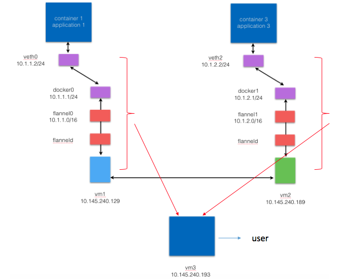

# vNetTracer
vNetTracer is a network tracing system, which enables flexible and programmable network performance monitoring for virtualized networks in a highly efficient manner. vNetTracer traces the packets at user defined tracepoints through eBPF programs, which can be executed, modified and deleted at runtime. vNetTracer decomposes and attributes network performance to various components inside the virtualized network, which can help monitor network performance, locate bottlenecks, and recognize potential issues.

# Dependency 

You need:

> gcc, python and bcc (https://github.com/iovisor/bcc)

Kernel modification: 

> sender and receiver side: search "by Kun" in the following files:

TCP: 

> include/net/netns/ipv4.h

> net/ipv4/sysctl_net_ipv4.c

> net/ipv4/tcp_ipv4.c

> net/ipv4/tcp_output.c

UDP: 

> net/ipv4/udp.c

To get TCP header options (default value is 0): 

> $ sudo sysctl -n net.ipv4.tcp_option

To enable TCP header options: 

> $ sudo sysctl -w net.ipv4.tcp_option=1

# Usage 

To adopt vNetTracer in your systems, please follow the steps below:

1, Use the template bpf script to write and configure your own tracing scripts.

To configure your tracing:

> modify the files in the config folder based on your tracing purpose, such as IP addresses, ports, etc.

To write your tracing logic:

> modify the script.c file and add your c code inside.

2, Execute the tracing scripts to collect raw tracing data.

> $ python script.py

3, Calculate the raw tracing data and analyze the potential problems. 

# Example 

Take multiple host container network latency tracing as an example. 

Step 1:

Based on the network architecture, environment and tracing goals, edit the configuration files and ebpf scripts. For instance, all tracing files under vnettracer/example/vm1/ are used for packet tracing from containerized applications to the vm1 network stack. We added three functions and attached them to veth0, flannel0 and eth0 on vm1. The functions collect the raw data including tracing time, tracepoint location and message content. Besides, set up the global configuration for the database. In this example, we used influxdb (https://www.influxdata.com/) and run it on vm3. We created database tables for each individual tracepoint. The table format is <time (number), tracepoint location (number) and packet message (string)>.

For ubuntu, install and start the InfluxDB service:
> $ sudo apt-get update && sudo apt-get install influxdb

> $ sudo service influxdb start 

For centos,
> $ sudo yum install influxdb

> $ sudo systemctl start influxdb

> $ CREATE DATABASE db_name

Step 2:

Execute the eBPF scripts on each vm. 

> $ python script.py

Once the raw tracing data is fetched, they will be sent to the database on vm3. To mitigate the overhead, options such as writing data to local memory (see ebpf templates) or pinning scripts to specific CPU core can be adopted.

Step 3:

After the data is collected, further operations such as data cleaning or calculation can be done for future analysis. In this example, we calcuate the time between two tracepoints to attribute network latency to various components inside the container virtualized stack. For tracepoints on the same node, just calculate the difference delta(T) of two tracing time. For tracepoints on the different nodes, add or remove the time skew between the two nodes from the above difference delta(T). 

